# Fracking & UOGD — Academic Paper Analysis

> **NLP · Text Mining · Environmental Economics**  
> David Muñoz · 2026

---

## Papers analyzed

| ID | Authors | Title | Journal | Year |
|---|---|---|---|---|
| P01 | Black, Boslett, Hill, Ma, McCoy | Economic, Environmental, and Health Impacts of the Fracking Boom | SSRN Working Paper | 2021 |
| P02 | Hwang, Heo, Lim, Park | Environmental Implications of Shale Gas Hydraulic Fracturing | *Water* (MDPI) | 2023 |
| P03 | Makki, Maalouf, Yehya | Review of the environmental and health risks of hydraulic fracturing fluids | *Heliyon* | 2025 |
| P04 | Zhang et al. | Towards sustainable oil/gas fracking by reusing its process water | *J. Petroleum Science & Engineering* | 2022 |

**Total corpus:** 96 pages · 71,086 tokens · 26 figures extracted

---

## How to run

```bash
git clone https://github.com/DavidMume/fracking-papers-analysis.git
cd fracking-papers-analysis
pip install pymupdf spacy pandas pillow
python -m spacy download en_core_web_sm
python scripts/extract_lemmatize.py
```

---

---

# P01 — Economic, Environmental, and Health Impacts of the Fracking Boom

**Authors:** Katie Black · Andy Boslett · Elaine Hill · Lala Ma · Shawn J. McCoy  
**Source:** SSRN Working Paper 3780721 · February 2021  
**Type:** Systematic literature review  
**Link:** https://ssrn.com/abstract=3780721

### What it is

A comprehensive review of the academic literature on the local economic and environmental impacts of unconventional oil and gas development (UOGD) in the United States since the shale boom. Covers research published after Mason et al. (2015), the previous benchmark review in the field.

### Main sections covered

Environment · Health · Migration · Education · Labor & Income · Agriculture · Environmental Justice · Welfare

### Key findings

**Environment**
- UOGD is the largest source of VOC emissions in the US (14% of national total)
- An additional gas well within 1 km of groundwater sources increases UOGD-related contaminants by ~1% and detection rates by 10–20% (Hill & Ma 2017, 2020)
- Coal-fired electricity generation declined >60% between 2007–2019, partly from natural gas substitution — with health benefits estimated at **$17 billion/year** (Johnsen et al. 2019)
- Cheap natural gas decreases green innovation in the medium/long run (Acemoglu et al. 2019)

**Health**
- UOGD consistently associated with reduced birth weight and preterm birth across Colorado, Pennsylvania, Texas, Oklahoma, California and British Columbia
- In utero drilling exposure increases preterm birth and low birth weight by **9–13%** (Hill & Ma 2020)
- Associations documented with asthma exacerbation, heart attacks, pneumonia and opioid mortality
- UOGD areas show increased rates of gonorrhea, traffic accidents and mental health disorders

**Labor & Income**
- UOGD boom generated ~650,000 jobs; each $1M in new production → +$80K in county wage income (Feyrer et al. 2017)
- Private UOGD royalties reached **$40 billion/year** in 2014; accounted for 70% of all personal income gains from the boom (Brown et al. 2019)
- Income gains concentrated in non-college educated men and minority workers in Texas

**Environmental Justice**
- Hispanic, African American and low-income populations disproportionately exposed to UOGD
- Local residents (non-mineral owners) received only **6.3%** of total production value in Denton, TX
- Non-local mineral owners captured **61.4%** of all royalty value

**Housing**
- Homes near drilling sell at a **9.9–16.5% discount** (Muehlenbachs et al. 2015)
- Properties with severed mineral rights show post-drilling price declines of **>30%** (Boslett et al. 2019)

### Conclusions

> *"Current economic, global, and health forces may require researchers to revisit outcomes in the face of a potential shale bust."*

The literature documents net welfare gains from consumer surplus ($48–71B/year) but substantial localized environmental and health costs. Causal inference methods (DID, IV, regression discontinuity) are increasingly critical for identifying true effects. The COVID-19 pandemic triggered a major contraction of the sector, and the boom-period literature may not generalize to bust conditions.

### Figures extracted from paper

| Figure | Description |
|---|---|
| 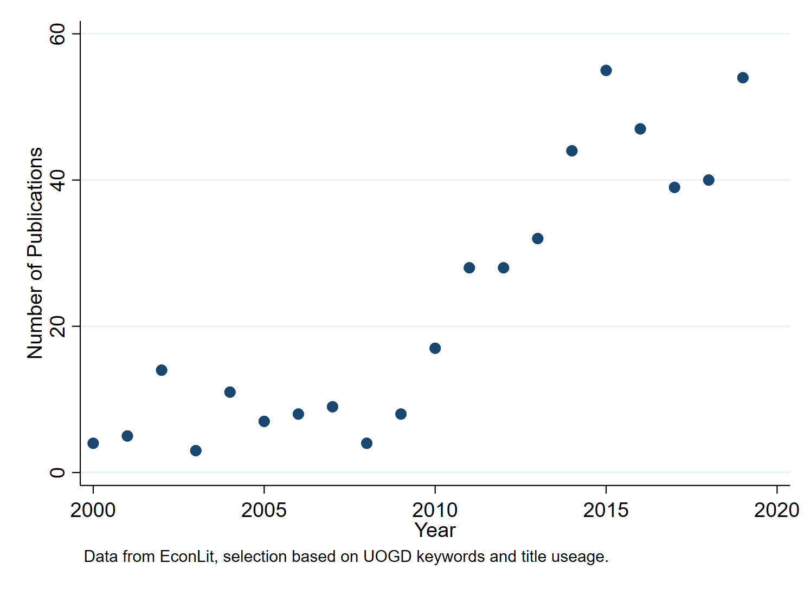 | **Fig. 1** — Yearly UOGD EconLit publication counts 2000–2020. Shows exponential growth in research output alongside the shale boom. |
| 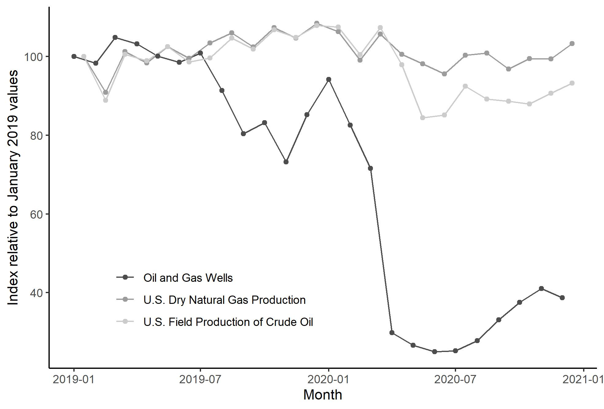 | **Fig. 2** — US monthly oil and gas production and wells drilled (2010–2020). Shows the 80% collapse in drilling activity in April 2020 from COVID-19. |

---

---

# P02 — Environmental Implications of Shale Gas Hydraulic Fracturing

**Authors:** Bohyun Hwang · Joonghyeok Heo · Chungwan Lim · Joonkyu Park  
**Source:** *Water* (MDPI) 2023, 15, 3334  
**Institutions:** Ohio State University · University of Texas–Permian Basin · Kongju National University · Seoil University  
**Type:** Systematic literature review  
**DOI:** 10.3390/w15193334

### What it is

A comprehensive review focused specifically on **water contamination and induced seismicity** from hydraulic fracturing in the US, covering federal reports and peer-reviewed literature up to July 2023. The hydraulic fracturing industry is projected to grow from USD 15.31B (2021) to USD 28.93B (2028) at a 9.5% CAGR.

### Main sections covered

Water Use · Groundwater Contamination · Surface Water · Soil Contamination · Induced Seismicity · Air Pollution · Remediation Technologies

### Key findings

**Water consumption**
- Average water use: **2.4 million gallons per well**
- Only **15–35%** of injected water is typically recovered at the surface
- The remaining 65–85% stays in the subsurface, raising migration and aquifer contamination risks

**Water contamination**
- Methane migration into drinking water wells documented near active fracturing sites
- Contaminants detected include: benzene, toluene, ethylbenzene, xylene (BTEX), chloride, barium, strontium and radium
- Surface spills are a primary documented pathway for soil and surface water contamination

**Induced seismicity**
- Wastewater injection wells (not fracturing itself) are the primary cause of induced seismicity
- Oklahoma experienced a 40× increase in M≥3 earthquakes between 2009–2015, coinciding with increased injection
- Seismicity risk correlated with proximity to faults, injection volume and rate

**Air pollution**
- VOC, methane, NOx and particulate matter emissions during all phases of well development
- Silica dust from proppant handling poses occupational health risks

**Remediation / best practices**
- Garfield County, Colorado: demonstrated **100% wastewater reuse** for hydraulic fracturing — cited as a model for eliminating freshwater demand
- Advances in membrane treatment, thermal distillation and electrocoagulation for FPW treatment
- Remote monitoring and real-time sensing proposed for early contamination detection

### Conclusions

> *"These findings underscore the need for stringent regulations, sustained research, and effective management practices."*

The review calls for a **collaborative approach** combining field studies, experimental research and computational modeling. The 15–35% recovery rate creates a structural uncertainty about subsurface fluid fate that current regulations do not adequately address. The Garfield County 100% reuse model is presented as a technically viable path to significantly reduce environmental impact.

### Figures extracted from paper

| Figure | Description |
|---|---|
|  | Journal / publisher logos |
| 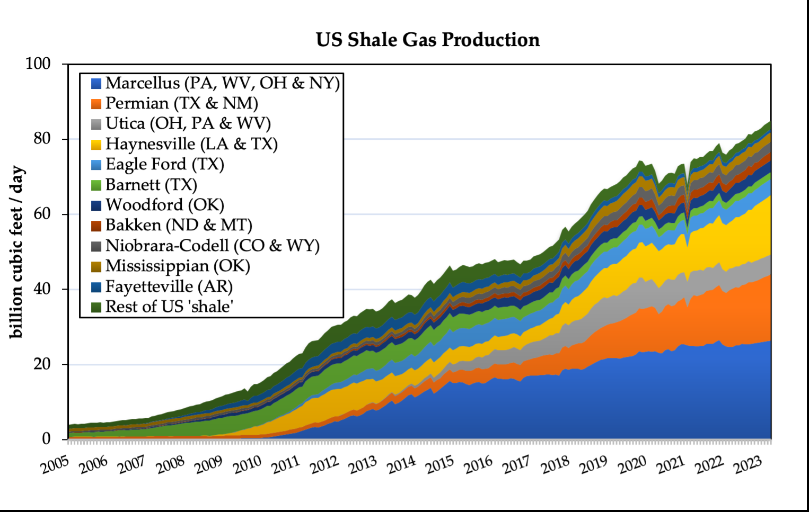 | **Fig. 1** — Conceptual diagram of hydraulic fracturing water cycle: injection, flowback, produced water and disposal pathways |
| 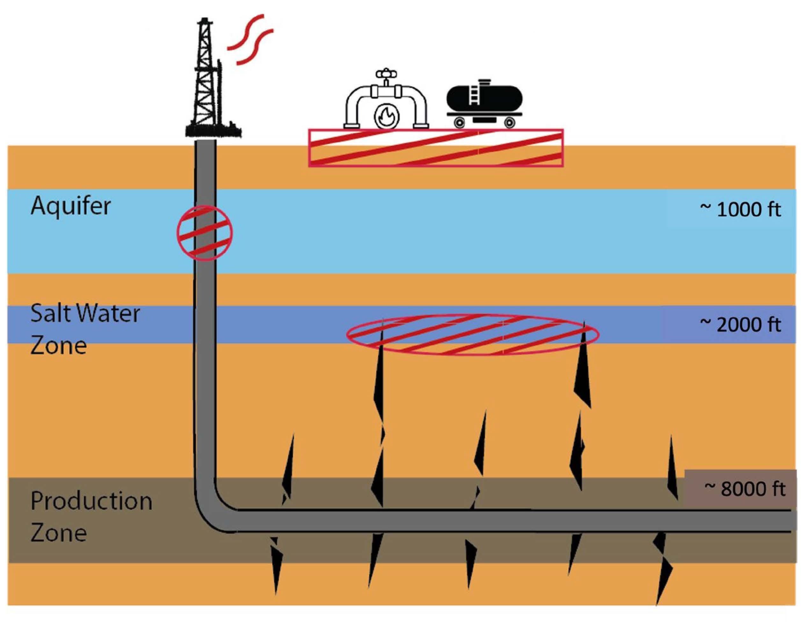 | **Fig. 2** — Map or diagram of contamination pathways and monitoring zones |
| 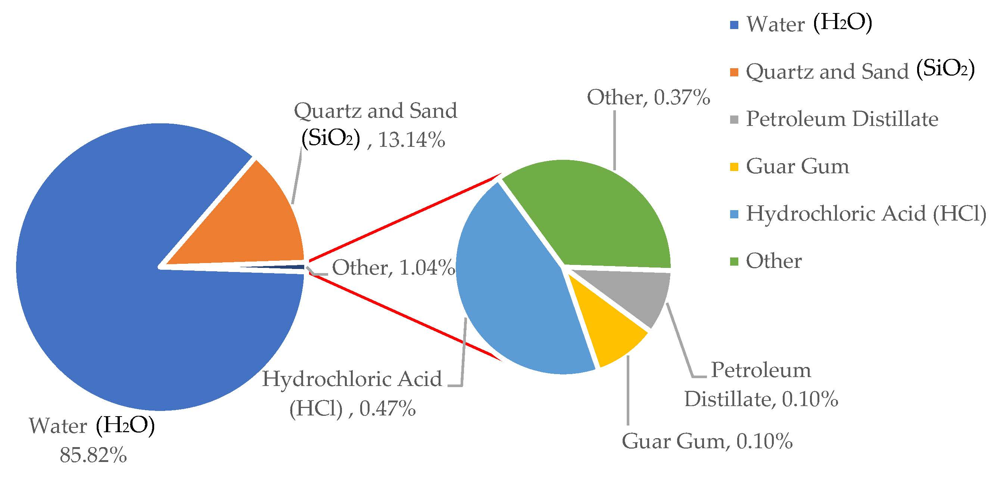 | **Fig. 3** — Induced seismicity frequency and magnitude distribution across US shale regions |

---

---

# P03 — Review of the Environmental and Health Risks of Hydraulic Fracturing Fluids

**Authors:** Sara Makki · Elsa Maalouf · Alissar Yehya  
**Source:** *Heliyon* 11 (2025) e40883 · Published December 2024  
**Institutions:** American University of Beirut · Harvard John A. Paulson School of Engineering and Applied Sciences  
**Type:** Review article  
**DOI:** 10.1016/j.heliyon.2024.e40883

### What it is

A focused review on the **composition, toxicity, fate and risks of hydraulic fracturing (HF) fluid** — the mixture injected into wells. Unlike papers focused on geology or economics, this paper concentrates on the fluid itself: what's in it, where it goes, what it does to health and the environment, and why so little is known.

### Main sections covered

HF Fluid Composition · Toxicity · Spill Data · Flowback Ratio · Fluid Migration · Induced Seismicity · Regulatory Disclosure Gaps

### Key findings

**HF fluid composition**
- Contains hundreds of chemicals: gelling agents, friction reducers, biocides, scale inhibitors, surfactants and crosslinkers
- Many ingredients are classified as trade secrets — full disclosure is not legally required in most US states
- EPA identified **1,084 unique chemicals** used between 2005–2013; toxicity data is missing for a significant fraction

**Recovery rate (the core problem)**
- Flowback and produced water (FPW) recovery: **10–50%** of injected volume
- This means **50–90% of injected HF fluid remains in the subsurface** in some formations
- Negative correlations found between recovery rate and:
  - Shut-in period (longer shut-in → less flowback)
  - Fracture network complexity (more complex → less recovery)
  - Induced seismicity (higher seismicity → lower recovery)
- Positive correlation: faster migration speed in formations with **more permeable pathways**

**Environmental and health hazards**
- Documented aquifer contamination cases linked to FPW migration through natural or induced fractures
- High concentration of toxic chemicals + limited toxicity data = underestimated risk profile
- Probability of surface spills is high: synthesized spill data shows thousands of documented incidents

**Induced seismicity from HF fluids**
- HF fluid injection itself (not only wastewater disposal) can trigger seismicity in some conditions
- Mitigation strategy proposed: cyclic injection to reduce pressure buildup

### Conclusions

> *"The main handicap in assessing related risks is the scarcity of disclosure and monitoring data."*

The paper argues that the most urgent action is **regulatory reform on chemical disclosure**: without knowing what is being injected or where it goes, risk assessment is systematically incomplete. It calls for mandatory spill reporting, unified national databases and more peer-reviewed studies specifically examining HF fluid fate and toxicity.

### Figures extracted from paper

| Figure | Description |
|---|---|
| 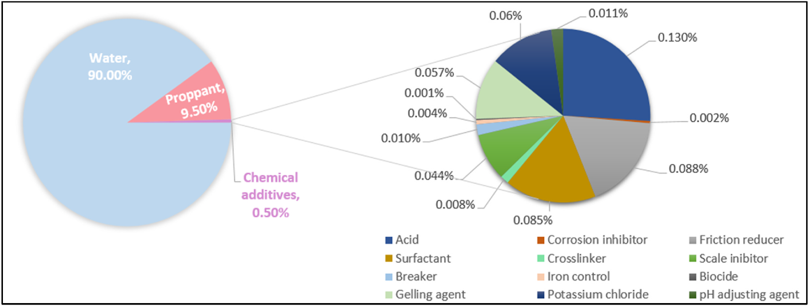 | **Fig. 1** — Composition breakdown of typical HF fluid: water (~90%), proppant (~9%), chemical additives (~1%) |
| 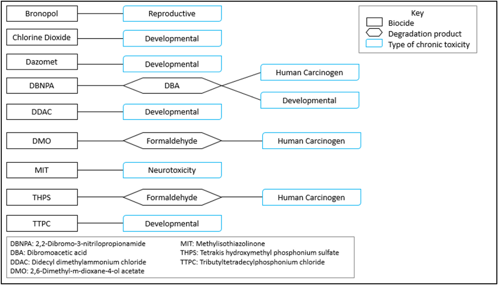 | **Fig. 2** — Schematic of HF fluid injection, flowback and subsurface migration pathways |
| 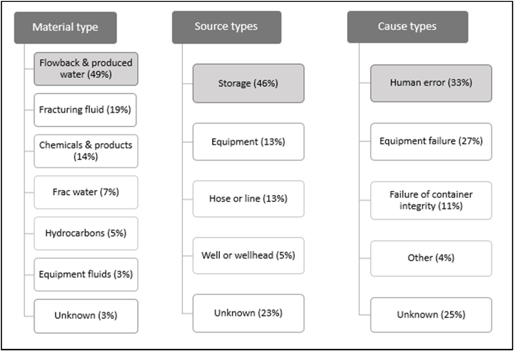 | **Fig. 3** — Factors affecting flowback ratio and fluid fate in the subsurface |
| 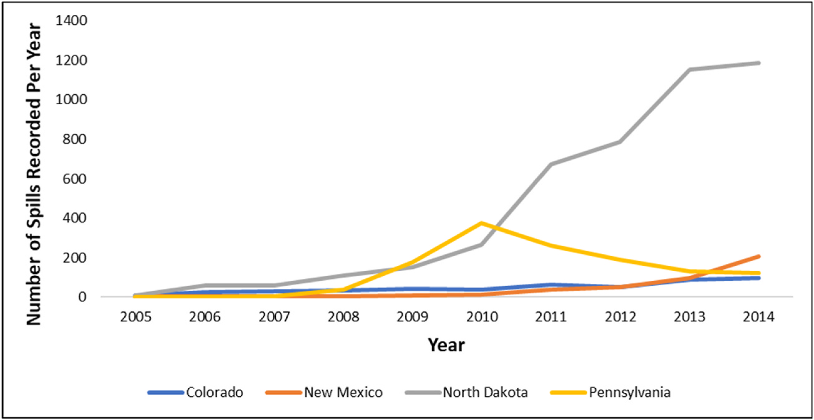 | **Fig. 4** — Spill frequency and volume data by state/region |
| 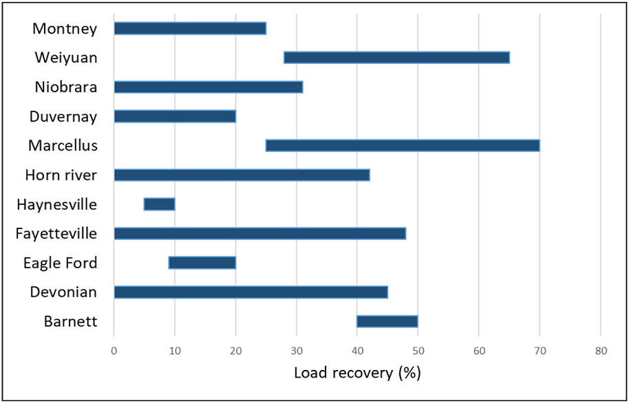 | **Fig. 5** — Correlation matrix: recovery rate vs. operational and geological parameters |

---

---

# P04 — Towards Sustainable Oil/Gas Fracking by Reusing Its Process Water

**Authors:** Yang Zhang · Jinhua Mao · Jincheng Mao · An Chen · Xiaojiang Yang · Chong Lin · Zhihong Wei · Xiaoliang Huang · Li Song · Feng Tang · Qi Jiang · Yonghao Ni  
**Source:** *Journal of Petroleum Science and Engineering* 213 (2022) 110422  
**Institutions:** Southwest Petroleum University (Chengdu, China) · University of New Brunswick (Canada) · BHDC (Renqiu, China)  
**Type:** Review article  
**DOI:** 10.1016/j.petrol.2022.110422

### What it is

A technical review addressing the **fundamental challenge of reusing flowback and produced water (FPW)** — the water that comes back out of fracking wells — as a replacement for freshwater in new fracking operations. The paper is engineering-focused: it reviews the chemistry, materials science and process design needed to make this work at scale.

### The core problem

FPW has **very high total dissolved solids (TDS)** — salts, heavy metals, organic compounds, radioactive materials — that interfere with the chemistry of fracking fluids. Standard fracking fluids fail under high-salt conditions. The paper reviews what makes a fluid salt-resistant and how to design one.

### Context

- Shale gas production in the US grew from **19.6 × 10⁸ m³ (1980) to 7,362 × 10⁸ m³ (2020)** — representing **78% of total US natural gas production in 2020**
- Global energy demand projected to grow 28% by 2045; oil and gas expected to remain >50% of the energy mix
- Water stress is a binding constraint: fracking typically requires 2–5 million gallons of fresh water per well

### Key findings

**FPW characteristics**
- TDS can range from 10,000 to over 300,000 mg/L (seawater is ~35,000 mg/L)
- Contains: barium, strontium, calcium, magnesium, chloride, bromide, NORM (naturally occurring radioactive material), dissolved organics, bacteria
- Composition varies significantly by formation, region and production age

**Technical challenges for FPW reuse**
- High salinity degrades gelling agents (guar, synthetic polymers)
- Divalent cations (Ba²⁺, Ca²⁺) cause crosslinker failure and scale deposition
- Bacteria in FPW can cause biofouling, H₂S production and polymer degradation
- Temperature resistance required for deep wells (>120°C)

**Proposed solutions**
1. **Salt-tolerant gelling agents:** grafting synthetic polymers (acrylamide-based) onto biopolymers (guar)
2. **Bio-based nano-crosslinkers:** replace traditional Zr/Ti crosslinkers with lower-toxicity alternatives
3. **Cost-effective nano-breakers:** allow polymer degradation after fracture creation without damaging the formation
4. **Friction reducers (FRs):** high-elasticity, salt-resistant polymers that maintain performance in high-TDS conditions

**Environmental and economic case**
- FPW reuse reduces freshwater withdrawal, wastewater disposal costs and injection well usage (→ less seismicity risk)
- Economic savings estimated at significant scale given >50% of injection costs relate to water logistics
- Environmental benefit: eliminates disposal pathway that drives induced seismicity

### Conclusions

> *"A new type of fracturing fluid should be developed... which will have great potential for the reuse of FPW and the development of unconventional formations."*

The paper proposes a **next-generation fracturing fluid** combining a biopolymer-synthetic polymer hybrid gelling agent, bio-based nano-crosslinkers, nano-breakers and high-performance friction reducers. This fluid should maintain performance in high-salt, high-temperature conditions while being biodegradable and cost-competitive. The authors position FPW reuse as the primary lever for making fracking sustainable — more practical and faster to implement than eliminating fracking itself.

### Figures extracted from paper

| Figure | Description |
|---|---|
| 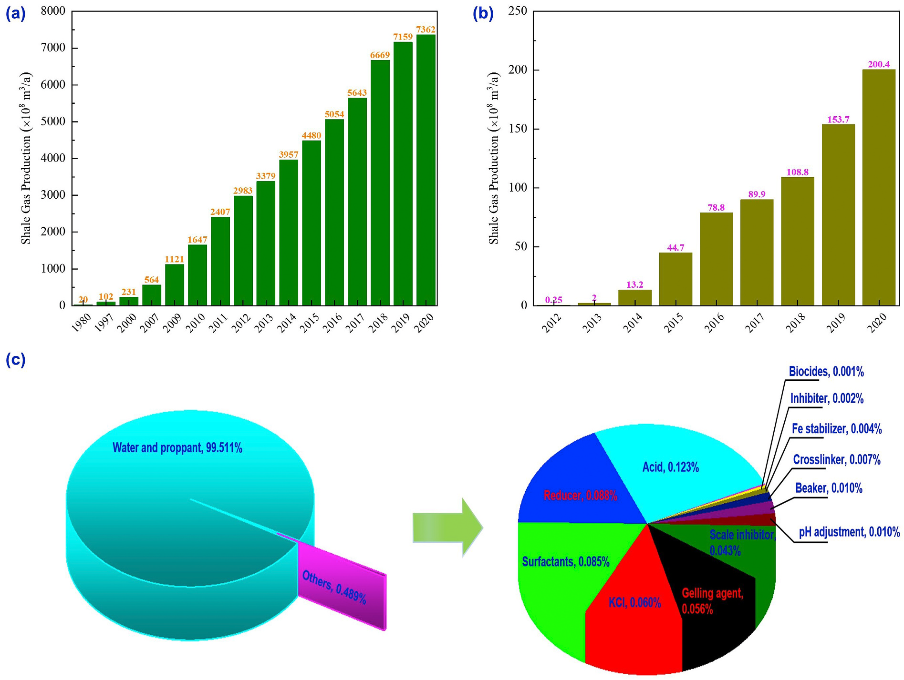 | **Fig. 1** — US shale gas production growth 1980–2020 and comparison with other countries |
| 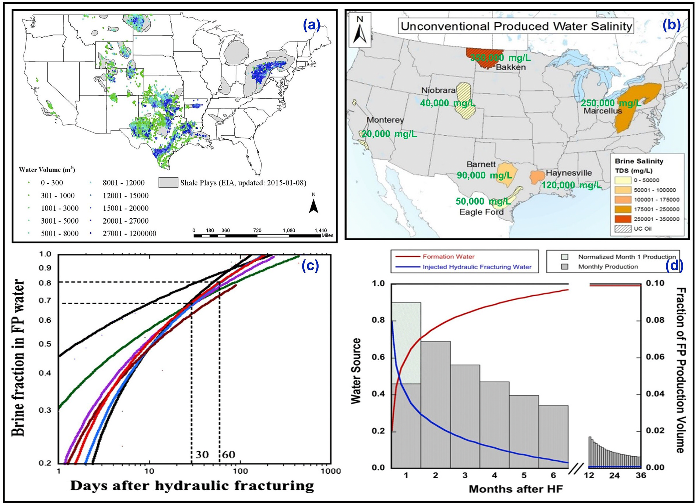 | **Fig. 2** — Composition and TDS range of flowback and produced water (FPW) by formation |
| 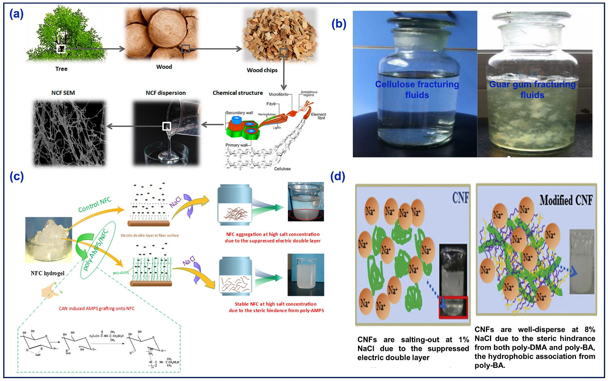 | **Fig. 3** — Salt effects on polymer gelling agent performance: viscosity vs. NaCl concentration |
| 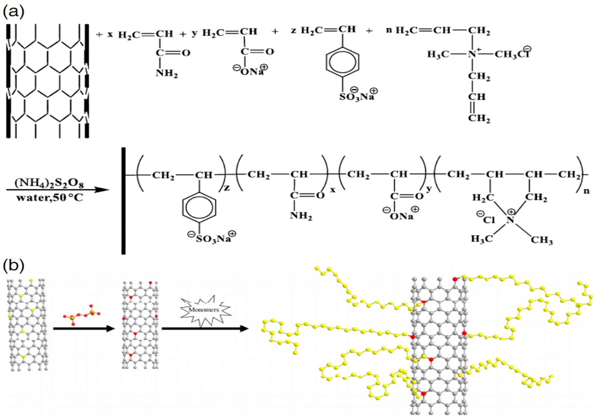 | **Fig. 4** — Nano-crosslinker structure and mechanism for salt-resistant fracturing fluid |
| 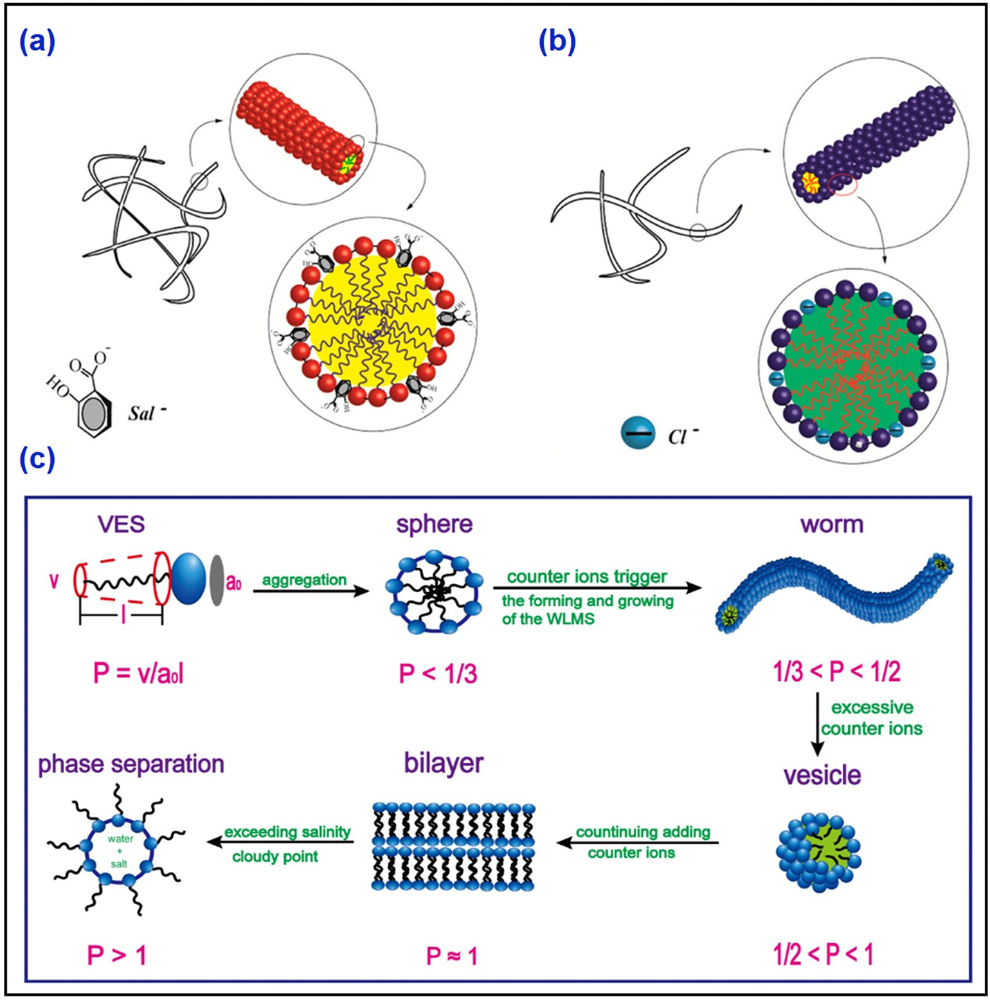 | **Fig. 5** — Comparison of conventional vs. FPW-adapted fracturing fluid performance |
| 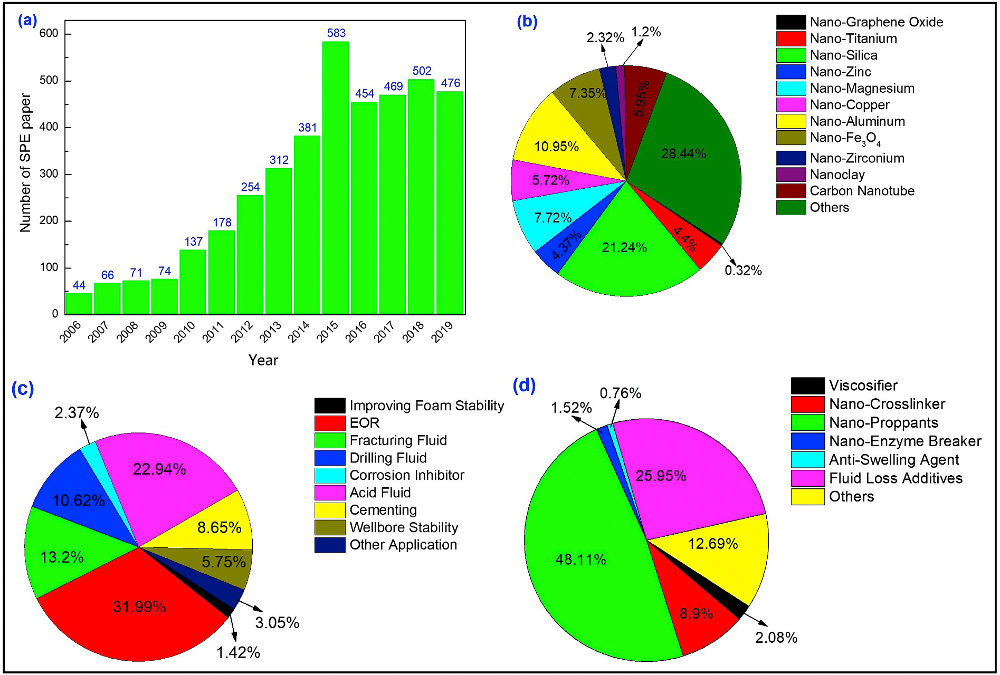 | **Fig. 6** — Friction reducer performance in high-TDS conditions |
| 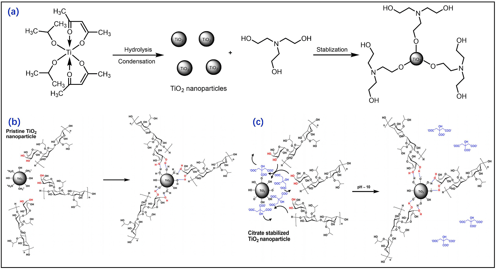 | **Fig. 7** — Proposed architecture of the next-generation sustainable fracturing fluid |
| 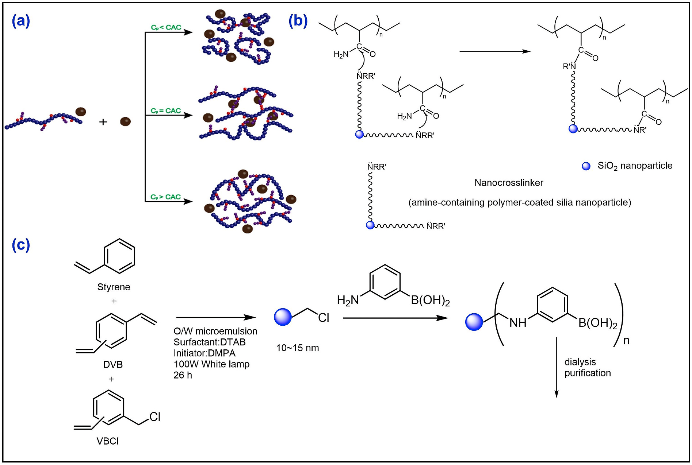 | **Fig. 8** — Environmental and economic benefits framework for FPW reuse |
| 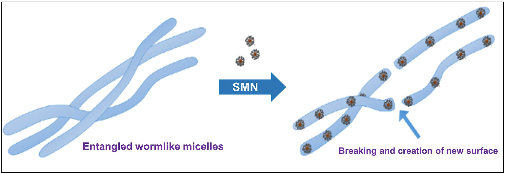 | **Fig. 9** — Temperature resistance of salt-tolerant polymer systems |
| 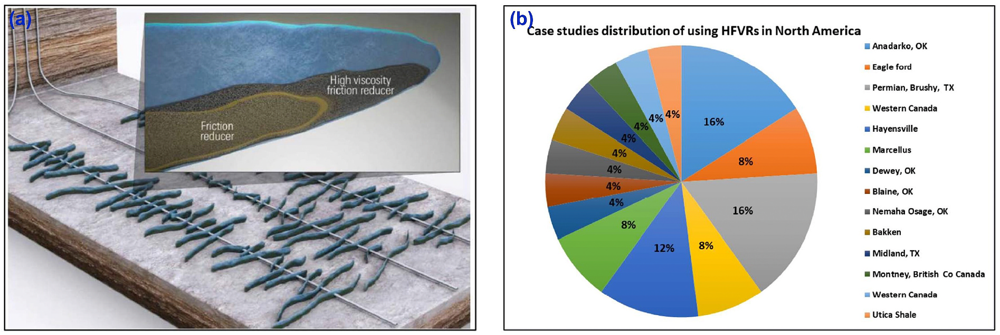 | **Fig. 10** — Roadmap for sustainable fracking water management |

---

---

# Cross-paper synthesis

## Four perspectives on the same problem

| Dimension | P01 (Economics) | P02 (Hydrology) | P03 (Chemical Eng.) | P04 (Petroleum Eng.) |
|---|---|---|---|---|
| **Focus** | Costs & benefits at community level | Water & seismicity impacts | HF fluid composition & fate | FPW reuse technology |
| **Methodology** | Quasi-experimental economics (DID, IV) | Systematic literature review | Synthesis + correlation analysis | Materials science review |
| **Water problem** | WTP to avoid contamination | 2.4M gal/well, 15–35% recovery | 10–50% recovery; migration risk | High-TDS reuse challenge |
| **Key number** | $48–71B/year welfare gain | 9.5% CAGR industry growth | 1,084 chemicals identified | 78% of US gas from shale (2020) |
| **Main concern** | Distribution of costs vs. benefits | Insufficient regulation | Disclosure gaps | Freshwater scarcity |
| **Proposed solution** | Causal research + policy design | Stringent monitoring + Garfield model | Mandatory disclosure + databases | Salt-resistant fracturing fluid |

## Convergent conclusions across papers

1. **Water is the binding constraint.** All 4 papers identify water — its consumption, contamination or reuse — as the central environmental challenge of fracking.

2. **What goes down doesn't come back.** P02 and P03 independently document that 50–90% of injected fluid stays in the subsurface, with poorly understood fate.

3. **Disclosure is systemically inadequate.** P03 documents ~1,084 chemicals injected with incomplete toxicity data. P01 shows that causal health effects remain hard to estimate precisely because of data gaps.

4. **There is a viable path to sustainability.** P02 shows 100% wastewater reuse is technically demonstrated (Garfield, CO). P04 shows the material science exists to make it work at scale. P01 shows the economic incentives are aligned (royalty income, consumer surplus) if externalities are properly priced.

5. **Environmental justice is unresolved.** P01 documents that those who bear the costs (resident non-mineral owners, minority communities) are structurally separated from those who capture the benefits (non-local mineral owners, gas companies, consumers).

---

## Repository structure

```
fracking-papers-analysis/
├── scripts/
│   └── extract_lemmatize.py   ← full pipeline: text + lemmas + figures
├── figures/                   ← 26 figures extracted from 4 PDFs
│   ├── p01_fracking_boom_review/
│   ├── p02_water_contamination_seismicity/
│   ├── p03_hf_fluid_risks/
│   └── p04_process_water_reuse/
├── docs/
│   └── methodology.md
└── outputs/                   ← gitignored, generated locally
```

| Paper | Pages | Tokens | Lemmas vocab | Figures |
|---|---|---|---|---|
| P01 | 38 | 16,240 | 2,178 | 2 |
| P02 | 18 | 13,215 | 2,008 | 6 |
| P03 | 17 | 16,041 | 2,012 | 6 |
| P04 | 23 | 25,590 | 2,523 | 12 |
| **Total** | **96** | **71,086** | **~4,800** | **26** |

---

---

# SEGUNDA PARTE — ANÁLISIS EN ESPAÑOL

> *Versión en español del análisis completo para los cuatro artículos académicos sobre fracturamiento hidráulico (fracking) y desarrollo de petróleo y gas no convencional (UOGD).*

---

## Tabla de artículos analizados

| ID | Autores | Título | Revista | Año |
|---|---|---|---|---|
| P01 | Black, Boslett, Hill, Ma, McCoy | Impactos económicos, ambientales y de salud del auge del fracking | SSRN Working Paper | 2021 |
| P02 | Hwang, Heo, Lim, Park | Implicaciones ambientales del fracturamiento hidráulico de gas de esquisto | *Water* (MDPI) | 2023 |
| P03 | Makki, Maalouf, Yehya | Revisión de los riesgos ambientales y de salud de los fluidos de fracturamiento | *Heliyon* | 2025 |
| P04 | Zhang et al. | Hacia un fracking sostenible mediante la reutilización del agua de proceso | *J. Petroleum Science & Engineering* | 2022 |

**Corpus total:** 96 páginas · 71.086 tokens · 26 figuras extraídas

---

---

# P01 — Impactos económicos, ambientales y de salud del auge del fracking

**Autores:** Katie Black · Andy Boslett · Elaine Hill · Lala Ma · Shawn J. McCoy
**Fuente:** SSRN Working Paper 3780721 · Febrero 2021
**Tipo:** Revisión sistemática de la literatura económica
**Enlace:** https://ssrn.com/abstract=3780721

### De qué trata

Una revisión exhaustiva de la literatura académica sobre los impactos locales del desarrollo no convencional de petróleo y gas (UOGD) en Estados Unidos desde el auge del gas de esquisto. El artículo cubre la investigación publicada después de Mason et al. (2015), la revisión de referencia previa en el campo.

### Secciones principales

Medio Ambiente · Salud · Migración · Educación · Trabajo e Ingresos · Agricultura · Justicia Ambiental · Bienestar Social

### Principales hallazgos

**Medio ambiente**
- El UOGD es la mayor fuente de emisiones de COV (compuestos orgánicos volátiles) en EE.UU.: **14% del total nacional**
- Un pozo adicional dentro de 1 km de fuentes de agua subterránea aumenta los contaminantes relacionados con UOGD en ~1% y las tasas de detección entre 10–20% (Hill & Ma 2017, 2020)
- La generación de electricidad a carbón cayó más del 60% entre 2007–2019 por sustitución al gas natural — con beneficios para la salud estimados en **$17 mil millones/año** (Johnsen et al. 2019)
- El gas natural barato reduce la innovación en tecnologías verdes en el mediano y largo plazo (Acemoglu et al. 2019)

**Salud**
- El UOGD se asocia consistentemente con menor peso al nacer y mayor tasa de partos prematuros en Colorado, Pennsylvania, Texas, Oklahoma, California y Columbia Británica (Canadá)
- La exposición in útero al UOGD aumenta los partos prematuros y el bajo peso al nacer entre **9–13%** (Hill & Ma 2020)
- Se documentan asociaciones con exacerbación del asma, infartos cardíacos, neumonía y mortalidad por opioides
- Las zonas de fracking muestran mayores tasas de gonorrea, accidentes de tránsito y trastornos de salud mental

**Trabajo e ingresos**
- El auge del UOGD generó ~650.000 empleos; cada $1 millón en nueva producción → +$80.000 en ingresos salariales del condado (Feyrer et al. 2017)
- Las regalías privadas del UOGD alcanzaron **$40 mil millones/año** en 2014 y representaron el 70% de todas las ganancias de ingresos personales derivadas del auge (Brown et al. 2019)
- Las ganancias se concentraron en hombres sin título universitario y trabajadores de minorías en Texas

**Justicia ambiental**
- Las poblaciones hispanas, afroamericanas y de bajos ingresos están desproporcionadamente expuestas al UOGD
- Los residentes locales (sin derechos minerales) recibieron solo el **6,3% del valor total de producción** en Denton, Texas
- Los propietarios de derechos minerales no locales capturaron el **61,4%** de todas las regalías

**Mercado inmobiliario**
- Las viviendas cercanas a pozos se venden con un descuento de **9,9–16,5%** (Muehlenbachs et al. 2015)
- Propiedades con derechos minerales separados muestran caídas de precio de **más del 30%** tras la perforación (Boslett et al. 2019)

### Conclusiones

> *"Las fuerzas económicas, globales y de salud actuales pueden requerir que los investigadores revisiten los resultados ante una posible caída del sector de esquisto."*

La literatura documenta ganancias netas de bienestar por excedente del consumidor ($48–71 mil millones/año) pero costos ambientales y de salud severos y localizados. Los métodos de inferencia causal (diferencias en diferencias, variables instrumentales, regresión discontinua) son crecientemente críticos para identificar efectos reales. La pandemia de COVID-19 desencadenó una contracción importante del sector, y la literatura del período de auge podría no generalizarse al período de caída.

### Figuras del artículo

| Figura | Descripción |
|---|---|
|  | **Fig. 1** — Publicaciones anuales en EconLit sobre UOGD (2000–2020). Muestra el crecimiento exponencial de la investigación junto al auge del esquisto. |
|  | **Fig. 2** — Producción mensual de petróleo y gas en EE.UU. y pozos perforados (2010–2020). Muestra el colapso del 80% en perforación en abril de 2020 por COVID-19. |

---

---

# P02 — Implicaciones ambientales del fracturamiento hidráulico de gas de esquisto

**Autores:** Bohyun Hwang · Joonghyeok Heo · Chungwan Lim · Joonkyu Park
**Fuente:** *Water* (MDPI) 2023, 15, 3334
**Instituciones:** Universidad Estatal de Ohio · Universidad de Texas–Permian Basin · Universidad Nacional de Kongju · Universidad Seoil
**Tipo:** Revisión sistemática de la literatura
**DOI:** 10.3390/w15193334

### De qué trata

Una revisión enfocada específicamente en la **contaminación del agua y la sismicidad inducida** por el fracturamiento hidráulico en EE.UU., cubriendo informes federales y literatura revisada por pares hasta julio de 2023. La industria de fracturamiento hidráulico se proyecta crecer de USD 15.310 millones (2021) a USD 28.930 millones (2028) con una tasa de crecimiento anual compuesta del 9,5%.

### Secciones principales

Uso del agua · Contaminación del agua subterránea · Aguas superficiales · Contaminación del suelo · Sismicidad inducida · Contaminación del aire · Tecnologías de remediación

### Principales hallazgos

**Consumo de agua**
- Uso promedio de agua: **2,4 millones de galones por pozo**
- Solo entre el **15–35%** del agua inyectada se recupera en superficie
- El 65–85% restante permanece en el subsuelo, planteando riesgos de migración y contaminación de acuíferos

**Contaminación del agua**
- Se documenta migración de metano hacia pozos de agua potable cerca de sitios de fracturamiento activos
- Contaminantes detectados: benceno, tolueno, etilbenceno, xileno (BTEX), cloruro, bario, estroncio y radio
- Los derrames superficiales son la principal vía documentada de contaminación de suelos y aguas superficiales

**Sismicidad inducida**
- Los pozos de inyección de agua residual (no el fracturamiento en sí) son la causa principal de sismicidad inducida
- Oklahoma experimentó un aumento de **40 veces** en terremotos de magnitud ≥3 entre 2009–2015, coincidiendo con el aumento de inyección
- El riesgo sísmico se correlaciona con la proximidad a fallas, el volumen y la tasa de inyección

**Contaminación del aire**
- Emisiones de COV, metano, NOx y material particulado durante todas las fases del desarrollo de pozos
- El polvo de sílice del manejo del agente de sostén (proppant) representa un riesgo para la salud ocupacional

**Remediación y mejores prácticas**
- Condado de Garfield, Colorado: demostró **reutilización del 100% de las aguas residuales** para fracturamiento hidráulico — citado como modelo para eliminar la demanda de agua dulce
- Avances en tratamiento por membranas, destilación térmica y electrocoagulación para el tratamiento de FPW
- Se propone monitoreo remoto y sensores en tiempo real para detección temprana de contaminación

### Conclusiones

> *"Estos hallazgos subrayan la necesidad de regulaciones estrictas, investigación sostenida y prácticas de gestión efectivas."*

La revisión llama a un **enfoque colaborativo** que combine estudios de campo, investigación experimental y modelamiento computacional. La tasa de recuperación del 15–35% crea una incertidumbre estructural sobre el destino del fluido en el subsuelo que las regulaciones actuales no abordan adecuadamente. El modelo de reutilización al 100% del Condado de Garfield se presenta como un camino técnicamente viable para reducir significativamente el impacto ambiental.

### Figuras del artículo

| Figura | Descripción |
|---|---|
|  | **Fig. 1** — Diagrama conceptual del ciclo hídrico del fracturamiento hidráulico: inyección, retorno, agua producida y vías de disposición |
|  | **Fig. 2** — Vías de contaminación y zonas de monitoreo |
|  | **Fig. 3** — Distribución de frecuencia y magnitud de sismicidad inducida en regiones de esquisto de EE.UU. |

---

---

# P03 — Revisión de los riesgos ambientales y de salud de los fluidos de fracturamiento

**Autores:** Sara Makki · Elsa Maalouf · Alissar Yehya
**Fuente:** *Heliyon* 11 (2025) e40883 · Publicado diciembre de 2024
**Instituciones:** Universidad Americana de Beirut · Harvard John A. Paulson School of Engineering and Applied Sciences
**Tipo:** Artículo de revisión
**DOI:** 10.1016/j.heliyon.2024.e40883

### De qué trata

Una revisión enfocada en la **composición, toxicidad, destino y riesgos del fluido de fracturamiento hidráulico (HF)** — la mezcla que se inyecta en los pozos. A diferencia de artículos centrados en geología o economía, este artículo se concentra en el fluido mismo: qué contiene, adónde va, qué le hace a la salud y al ambiente, y por qué se sabe tan poco.

### Secciones principales

Composición del fluido HF · Toxicidad · Datos de derrames · Tasa de retorno · Migración del fluido · Sismicidad inducida · Brechas regulatorias de divulgación

### Principales hallazgos

**Composición del fluido HF**
- Contiene cientos de sustancias químicas: agentes gelificantes, reductores de fricción, biocidas, inhibidores de incrustaciones, surfactantes y entrecruzadores
- Muchos ingredientes están clasificados como secretos comerciales — la divulgación completa no es legalmente obligatoria en la mayoría de los estados de EE.UU.
- La EPA identificó **1.084 sustancias químicas únicas** usadas entre 2005–2013; los datos de toxicidad están incompletos para una fracción significativa

**Tasa de recuperación (el problema central)**
- Recuperación del agua de retorno y agua producida (FPW): **10–50%** del volumen inyectado
- Esto significa que **el 50–90% del fluido HF inyectado permanece en el subsuelo** en algunas formaciones
- Correlaciones negativas encontradas entre la tasa de recuperación y:
  - Período de cierre del pozo (mayor cierre → menos retorno)
  - Complejidad de la red de fracturas (más compleja → menos recuperación)
  - Sismicidad inducida (mayor sismicidad → menor recuperación)
- Correlación positiva: mayor velocidad de migración en formaciones con **vías más permeables**

**Riesgos ambientales y de salud**
- Casos documentados de contaminación de acuíferos vinculados a la migración de FPW a través de fracturas naturales o inducidas
- Alta concentración de sustancias tóxicas + datos de toxicidad limitados = perfil de riesgo subestimado sistemáticamente
- La probabilidad de derrames en superficie es alta: los datos de derrames sintetizados muestran miles de incidentes documentados

**Sismicidad inducida por fluidos HF**
- La inyección del propio fluido HF (no solo la disposición de aguas residuales) puede desencadenar sismicidad en ciertas condiciones
- Estrategia de mitigación propuesta: inyección cíclica para reducir la acumulación de presión

### Conclusiones

> *"El principal obstáculo para evaluar los riesgos relacionados es la escasez de datos de divulgación y monitoreo."*

El artículo argumenta que la acción más urgente es la **reforma regulatoria en divulgación de sustancias químicas**: sin saber qué se inyecta ni adónde va, la evaluación de riesgos es sistemáticamente incompleta. Llama a presentación de informes obligatoria de derrames, bases de datos nacionales unificadas y más publicaciones dedicadas a examinar la composición y el impacto del fluido HF.

### Figuras del artículo

| Figura | Descripción |
|---|---|
|  | **Fig. 1** — Composición típica del fluido HF: agua (~90%), agente de sostén (~9%), aditivos químicos (~1%) |
|  | **Fig. 2** — Esquema de inyección del fluido HF, retorno y vías de migración en el subsuelo |
|  | **Fig. 3** — Factores que afectan la tasa de retorno y el destino del fluido en el subsuelo |
|  | **Fig. 4** — Frecuencia y volumen de derrames por estado/región |
|  | **Fig. 5** — Matriz de correlación: tasa de recuperación vs. parámetros operacionales y geológicos |

---

---

# P04 — Hacia un fracking sostenible mediante la reutilización del agua de proceso

**Autores:** Yang Zhang · Jinhua Mao · Jincheng Mao · An Chen · Xiaojiang Yang · Chong Lin · Zhihong Wei · Xiaoliang Huang · Li Song · Feng Tang · Qi Jiang · Yonghao Ni
**Fuente:** *Journal of Petroleum Science and Engineering* 213 (2022) 110422
**Instituciones:** Universidad de Petróleo del Suroeste (Chengdu, China) · Universidad de New Brunswick (Canadá) · BHDC (Renqiu, China)
**Tipo:** Artículo de revisión
**DOI:** 10.1016/j.petrol.2022.110422

### De qué trata

Una revisión técnica que aborda el **desafío fundamental de reutilizar el agua de retorno y el agua producida (FPW)** — el agua que regresa a la superficie desde los pozos de fracking — como sustituto del agua dulce en nuevas operaciones de fracturamiento. El artículo tiene enfoque ingenieril: revisa la química, la ciencia de materiales y el diseño de procesos necesarios para hacer esto viable a escala.

### El problema central

El FPW tiene un **contenido de sólidos disueltos totales (TDS) muy alto** — sales, metales pesados, compuestos orgánicos, materiales radiactivos — que interfiere con la química de los fluidos de fracturamiento. Los fluidos estándar de fracturamiento fallan en condiciones de alta salinidad. El artículo revisa qué hace que un fluido sea resistente a la sal y cómo diseñar uno.

### Contexto

- La producción de gas de esquisto en EE.UU. creció de **19,6 × 10⁸ m³ (1980) a 7.362 × 10⁸ m³ (2020)** — representando el **78% de la producción total de gas natural de EE.UU. en 2020**
- La demanda energética global se proyecta crecer un 28% para 2045; se espera que el petróleo y el gas sigan representando más del 50% de la mezcla energética
- El estrés hídrico es una restricción vinculante: el fracking típicamente requiere 2–5 millones de galones de agua dulce por pozo

### Principales hallazgos

**Características del FPW**
- El TDS puede oscilar entre 10.000 y más de 300.000 mg/L (el agua de mar tiene ~35.000 mg/L)
- Contiene: bario, estroncio, calcio, magnesio, cloruro, bromuro, NORM (material radiactivo de origen natural), orgánicos disueltos y bacterias
- La composición varía significativamente según la formación, la región y la edad de producción

**Desafíos técnicos para la reutilización del FPW**
- La alta salinidad degrada los agentes gelificantes (guar, polímeros sintéticos)
- Los cationes divalentes (Ba²⁺, Ca²⁺) causan falla del entrecruzador e incrustaciones
- Las bacterias en el FPW pueden causar bioincrustaciones, producción de H₂S y degradación del polímero
- Se requiere resistencia a la temperatura para pozos profundos (>120°C)

**Soluciones propuestas**
1. **Agentes gelificantes tolerantes a la sal:** injerto de polímeros sintéticos (base acrilamida) sobre biopolímeros (guar)
2. **Nano-entrecruzadores de base biológica:** reemplazar los entrecruzadores tradicionales de Zr/Ti por alternativas de menor toxicidad
3. **Nano-rompedores de bajo costo:** permiten la degradación del polímero después de la creación de fracturas sin dañar la formación
4. **Reductores de fricción (FR):** polímeros de alta elasticidad y resistencia a la sal que mantienen el desempeño en condiciones de alto TDS

**Caso ambiental y económico**
- La reutilización del FPW reduce la extracción de agua dulce, los costos de disposición de aguas residuales y el uso de pozos de inyección (→ menor riesgo sísmico)
- Ahorro económico significativo dado que más del 50% de los costos de inyección están relacionados con la logística del agua
- Beneficio ambiental: elimina la vía de disposición que impulsa la sismicidad inducida

### Conclusiones

> *"Un nuevo tipo de fluido de fracturamiento debe ser desarrollado... lo que tendrá un gran potencial para la reutilización del FPW y el desarrollo de formaciones no convencionales."*

El artículo propone un **fluido de fracturamiento de próxima generación** que combina un agente gelificante híbrido biopolímero-polímero sintético, nano-entrecruzadores de base biológica, nano-rompedores y reductores de fricción de alto rendimiento. Este fluido debe mantener su desempeño en condiciones de alta salinidad y alta temperatura, siendo biodegradable y competitivo en costos. Los autores posicionan la reutilización del FPW como la palanca principal para hacer el fracking sostenible — más práctica y rápida de implementar que eliminar el fracking en sí.

### Figuras del artículo

| Figura | Descripción |
|---|---|
|  | **Fig. 1** — Crecimiento de la producción de gas de esquisto en EE.UU. (1980–2020) y comparación con otros países |
|  | **Fig. 2** — Composición y rango de TDS del agua de retorno y agua producida (FPW) por formación |
|  | **Fig. 3** — Efecto de la sal sobre el desempeño del agente gelificante: viscosidad vs. concentración de NaCl |
|  | **Fig. 4** — Estructura del nano-entrecruzador y mecanismo para fluido de fracturamiento resistente a la sal |
|  | **Fig. 5** — Comparación del desempeño entre fluido convencional y fluido adaptado para FPW |
|  | **Fig. 6** — Desempeño del reductor de fricción en condiciones de alto TDS |
|  | **Fig. 7** — Arquitectura propuesta del fluido de fracturamiento sostenible de próxima generación |
|  | **Fig. 8** — Marco de beneficios ambientales y económicos de la reutilización del FPW |
|  | **Fig. 9** — Resistencia a la temperatura de los sistemas poliméricos tolerantes a la sal |
|  | **Fig. 10** — Hoja de ruta para la gestión sostenible del agua en el fracking |

---

---

# Síntesis transversal en español

## Cuatro perspectivas sobre el mismo problema

| Dimensión | P01 (Economía) | P02 (Hidrología) | P03 (Ing. Química) | P04 (Ing. Petróleo) |
|---|---|---|---|---|
| **Enfoque** | Costos y beneficios a nivel comunitario | Impactos en agua y sismicidad | Composición y destino del fluido HF | Tecnología de reutilización del FPW |
| **Metodología** | Economía cuasi-experimental (DID, VI) | Revisión sistemática de literatura | Síntesis + análisis de correlación | Revisión de ciencia de materiales |
| **Problema del agua** | DAP para evitar contaminación | 2,4M galones/pozo, 15–35% recuperado | 10–50% recuperación; riesgo de migración | Desafío de reutilizar FPW con alto TDS |
| **Cifra clave** | $48–71 mil millones/año en bienestar | CAGR del 9,5% en la industria | 1.084 sustancias químicas identificadas | 78% del gas de EE.UU. desde esquisto (2020) |
| **Preocupación principal** | Distribución de costos vs. beneficios | Regulación insuficiente | Brechas en divulgación | Escasez de agua dulce |
| **Solución propuesta** | Investigación causal + diseño de política | Monitoreo estricto + modelo Garfield | Divulgación obligatoria + bases de datos | Fluido de fracturamiento resistente a la sal |

## Conclusiones convergentes entre los cuatro artículos

1. **El agua es la restricción vinculante.** Los 4 artículos identifican el agua — su consumo, contaminación o reutilización — como el desafío ambiental central del fracking.

2. **Lo que baja no vuelve a subir.** P02 y P03 documentan independientemente que el 50–90% del fluido inyectado permanece en el subsuelo, con un destino poco comprendido.

3. **La divulgación es sistémicamente insuficiente.** P03 documenta ~1.084 sustancias inyectadas con datos de toxicidad incompletos. P01 muestra que los efectos causales en salud son difíciles de estimar con precisión por las brechas en los datos.

4. **Existe un camino viable hacia la sostenibilidad.** P02 muestra que la reutilización del 100% de aguas residuales está técnicamente demostrada (Garfield, CO). P04 muestra que la ciencia de materiales existe para hacerlo funcionar a escala. P01 muestra que los incentivos económicos están alineados (ingresos por regalías, excedente del consumidor) si las externalidades se valoran correctamente.

5. **La justicia ambiental sigue sin resolverse.** P01 documenta que quienes cargan con los costos (residentes sin derechos minerales, comunidades minoritarias) están estructuralmente separados de quienes capturan los beneficios (propietarios de derechos minerales no locales, empresas de gas, consumidores).
